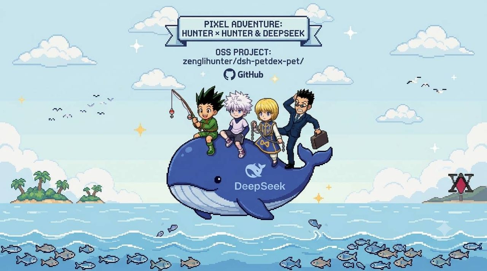
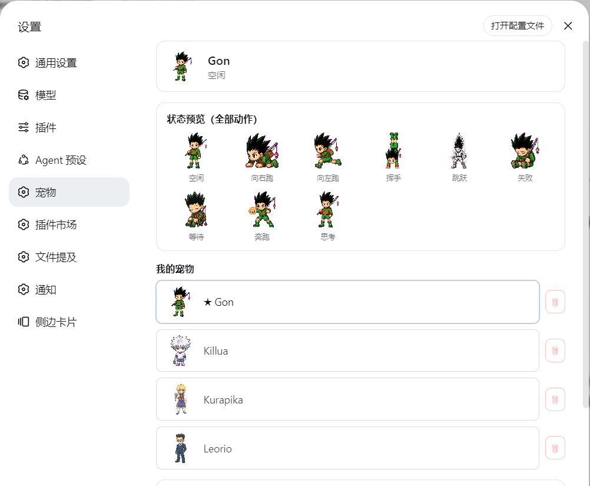
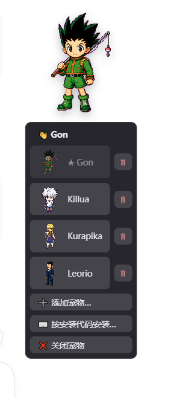
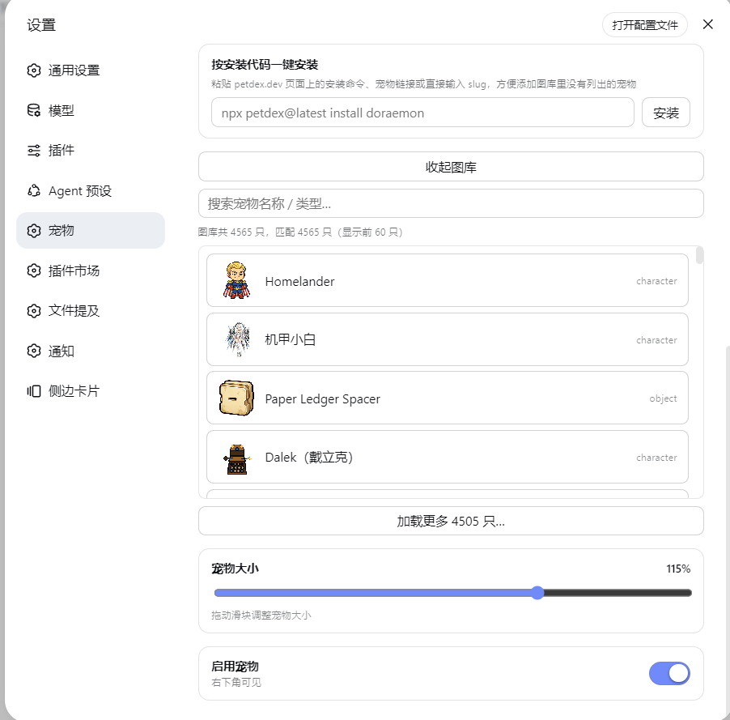

<p align="center">
  
</p>

📖 English documentation: README_EN.md

# dsh-petdex-pet

把 [Petdex](https://petdex.dev/) 桌面宠物带进 **DeepSeek Harness Web 界面**：
右下角悬浮、可拖拽，跟随 DSH 的智能体活动实时切换精灵动画（空闲 / 奔跑 / 跳跃 / 挥手 / 失败 / 等待批准…），
带完整的设置页和互动。

纯浏览器端渲染，**无需安装 Petdex 桌面端**；宠物数据读取 `~/.petdex/pets/`，与桌面端兼容共享。



更多界面截图：

| 宠物菜单 | 一键安装 & 在线获取宠物 |
| --- | --- |
|  |  |

## 内置宠物（开箱即用）

插件自带 **4 个全职猎人主角宠物包**（Gon 小杰 / Killua 奇犽 / Kurapika 酷拉皮卡 / Leorio 雷欧力，含精灵图与 pet.json）。
安装并重启 DSH 后，插件首次激活会自动把它们**播种**到 `~/.petdex/pets/`——新电脑装上插件就有宠物可用，不用再去图库一个个添加。

- 播种是**每只一次**的（由 `~/.petdex/.dsh-petdex-bundled.json` 标记文件记录）；
- 如果目标机器上已经有同名宠物，**不会覆盖**（保留已有文件）；
- 用户手动删除某只内置宠物后，**不会复活**（尊重删除操作）。

> ⚠️ 开源再分发提示：内置精灵图来自 Petdex 社区图库，公开发布前请确认其素材授权条款，并在项目说明中注明素材来源与致谢（见「致谢」）。

## 功能一览

- 🐾 右下角悬浮宠物：可拖拽、点击展开菜单；状态栏随 DSH 活动同步（工具调用、任务完成、等待批准、失败等），同一状态持续 5 秒自动隐藏。
- ✨ 互动动画：鼠标悬停随机挥手或「思考」问候；奔跑时自动轮播左右跑方向。
- ⚙️ 设置 → 宠物（独立设置页）：
  - 调整宠物大小（40%–150%）与启用/关闭
  - 我的宠物：缩略图列表、一键切换、🗑 删除
  - 图库：搜索（名称/类型）、精灵图预览、总数显示、加载更多
  - **按安装代码一键安装**：粘贴 `npx petdex@latest install doraemon`、宠物链接或 slug 即可安装
  - 状态预览：全部 9 种动作逐行动画展示
- 🔌 与 DSH 深度集成：任务开始（跳跃）、执行中（奔跑）、完成（挥手）、失败、等待批准（等待）…

## 精灵状态（9 行精灵图）

| 状态 | 精灵图行 | 触发时机 |
| --- | --- | --- |
| 空闲 `idle` | 0 | 无活动时 |
| 向右跑 `running-right` | 1 | 奔跑时轮播 |
| 向左跑 `running-left` | 2 | 奔跑时轮播 |
| 挥手 `waving` | 3 | 任务完成 / 悬停互动（随机） |
| 跳跃 `jumping` | 4 | 开始执行任务 |
| 失败 `failed` | 5 | 任务失败 |
| 等待 `waiting` | 6 | 等待批准 / 被阻塞 |
| 奔跑 `running` | 7 | 工具调用、工作流、步骤执行 |
| 思考 `review` | 8 | 悬停互动随机展示（暂无 DSH 事件映射） |

## 安装（DSH web profile）

本插件仅适用于 **DeepSeek Harness（DSH）**，需装进 DSH 的 **web profile**（默认 `C:\Users\<你>\.dsh\profiles\web\`）。

### 从 GitHub 安装（推荐，一键式）

1. 打开 web profile 目录，编辑 `package.json`：
   - `dependencies` 增加：
     ```json
     "@dsh-external/dsh-petdex-pet": "github:zenglihunter/dsh-petdex-pet"
     ```
   - `dsh.profile.bundles` 数组末尾增加 `"@dsh-external/dsh-petdex-pet"`；
2. 在该目录运行 `pnpm install`（或 `npm install`）；
3. 重启 DSH。设置页出现「宠物」项，右下角出现宠物。

> `cordis.patch.yml` 会由 DSH 自动组合（`dsh.bundle.patch`），无需手动改 profile 的 `cordis.patch.yml`。

### 其他方式（可选）

- **本地 tgz**：在插件目录 `npm pack` 生成 `dsh-external-dsh-petdex-pet-<version>.tgz`，拷到 profile 目录，依赖写 `"@dsh-external/dsh-petdex-pet": "file:./xxx.tgz"`。
- **npm 发布**：把 `package.json` 的 `name` 改成自己的 scope，再 `npm publish`，目标机器直接依赖包名即可。

## 数据与兼容

- 宠物文件在 `~/.petdex/pets/<slug>/`（`pet.json` + `spritesheet.webp|png`），与 Petdex 桌面端共用；
- 图库 manifest 来自 `https://petdex.dev/api/manifest`（5 分钟缓存），预览图走插件内网代理（`/petdex-pet/preview/<slug>`），避免浏览器外链被拦；
- 安装宠物走插件内置下载器，**不需要执行 `npx petdex`**。

## 开发

- `lib/index.js` — DSH 服务端半部：路由（状态/宠物/图库/安装/删除/预览代理/SSE）、会话事件 → 宠物状态机、设置持久化（owner 侧 settings scope）；
- `lib/client.js` — 浏览器端 bundle（`__ModuleLoader__` 格式）：悬浮宠物渲染/动画/拖拽/悬停、设置 → 宠物页面（slots 注册 `settings.section`）。

> 注意：客户端改动走 DSH 的 client HMR（stat-poll + SSE），改 `lib/client.js` 保存即热更新；改 `lib/index.js` 需要重启 DSH 生效。

## 致谢

- [Petdex](https://petdex.dev/) — 宠物精灵图、状态定义与图库；内置猎人宠物为 Petdex 社区作者提交的高质量 Codex 素材（Gon / Killua / Kurapika / Leorio）
- DeepSeek Harness 插件体系（client bundle / settings / slots）

## License

MIT